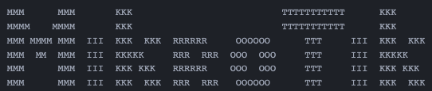

# :cowboy_hat_face: This is my configuration script router MikroTik RB7... RB9... :+1:

RouterMode:

- WAN port is protected by firewall and enabled DHCP client
- Wireless and Ethernet interfaces (except WAN port ether)
  are part of LAN bridge
