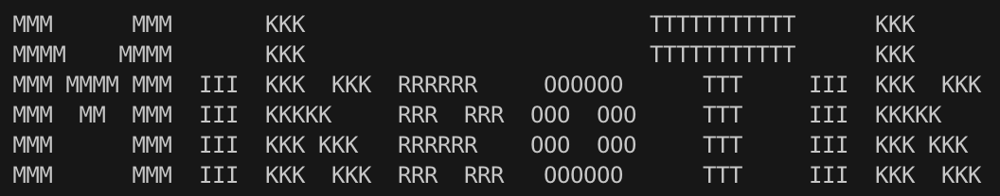

    :cowboy_hat_face: This my script config router MikroTik RB7... RB9... :+1: :thumbsup:

RouterMode:

- WAN port is protected by firewall and enabled DHCP client
- Wireless and Ethernet interfaces (except WAN port $provaiderInterface)
  are part of LAN bridge
